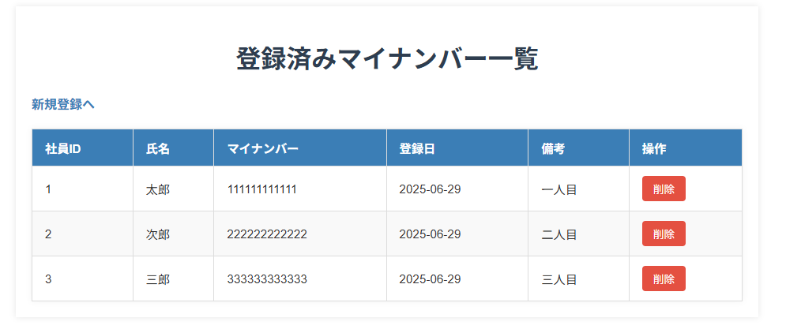
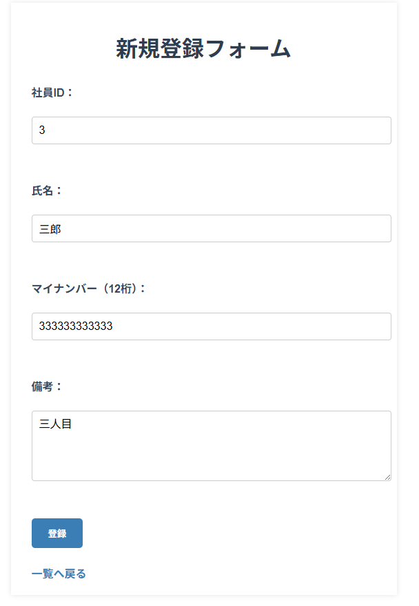

# 🏷️ MyNumber簡易管理アプリ（ローカル専用）

## 📌 概要
このアプリは、社員の「氏名・マイナンバー・備考」などの情報をローカル環境で簡易管理するWebアプリケーションです。  
Spring Bootを用いたMVC構成で、**新規登録・一覧表示・削除・編集機能**を備えています。  
Java/Springの基本的な理解と、Controller・Model・View連携の実践を目的として開発しました。

---

## 🛠️ 使用技術

| 項目             | 技術詳細 |
|------------------|-----------|
| 開発言語         | Java 17+ |
| フレームワーク   | Spring Boot（Web MVC、Spring Data JPA） |
| DB               | MySQL（ローカルDB） |
| テンプレート     | Thymeleaf |
| ビルド/依存管理  | Maven |
| IDE              | IntelliJ IDEA |
| 実行環境         | ローカルのみ（内蔵Tomcat利用） |

---

## ✨ 主な機能

| 機能                 | 説明 |
|----------------------|------|
| 新規登録             | 氏名・マイナンバー・備考を登録 |
| 一覧表示             | 登録情報を表形式で表示（登録日付き） |
| 削除                 | 社員IDをキーに1件ずつ削除可能 |
| 編集（更新）         | 社員情報の更新（画面UI付き）⭐️new |
| 登録日自動付与       | `LocalDate.now()` による自動設定 |
| 永続化（DB連携）     | MySQL + Spring Data JPAで保存 ⭐️new |

---

## 📷 画面構成

- `/form`：新規登録フォーム  
- `/list`：社員情報一覧表示（削除・編集ボタン付き）

---

## ⚠️ 現時点で省略している要素

| 要素                     | 理由・補足 |
|--------------------------|------------|
| 入力バリデーション       | 一部の手動チェックのみ。今後 `@Valid` などを活用予定 |
| 削除確認ダイアログ       | 未実装（UX改善として検討中） |
| 認証・認可（ログイン機能） | ローカル専用のため未対応。今後追加予定 |
| レスポンシブ対応         | PC表示のみ想定 |

---

## 🎯 今後の拡張予定

- ✅ ログイン機能（トップページをログイン画面に変更）★★★
- ✅ 削除時の確認ダイアログ実装でUX改善 ★★★    
- ✅ フォームバリデーション強化（必須入力、桁数・文字種チェック）★★  
- ✅マイナンバーフィールドの「未登録」表示★ 

---

## 🧠 このアプリで証明できること

- Spring BootによるMVC構成の理解と実装力
- Controller／Service／Repository／Modelの分離設計
- ThymeleafによるHTMLとJavaクラスの連携スキル
- DB永続化の実装（Spring Data JPA + MySQL）
- CRUDアプリ開発の基本フロー＋バグ修正対応力

---

## 🚀 実行方法（ローカル）

1. このリポジトリをクローン  
git clone https://github.com/BonchaN66/MyNumberApp.git
cd MyNumberApp

2. MySQLを起動・準備  
- DB作成（例：`mynumber_db`）  
- `application.properties` にDB接続情報を記述  

3. Mavenでビルド & アプリ起動  
- IntelliJで `MyNumberApplication.java` を実行  

4. ブラウザでアクセス  
- 新規登録画面 → http://localhost:8080/form  
- 一覧表示画面 → http://localhost:8080/list  

---

## 📝 更新履歴（簡易）

| 日付 | 内容 |
|------|------|
| 2025-07-20 | Spring Data JPA導入によりMySQL連携・DB永続化を実現 |
| 2025-07-26 | 編集（Update）機能追加 → 基本CRUDを完全実装 |

---

## 👤 開発者情報

- 名前：BonchaN
- 使用目的：学習用の個人開発（実用を見据えて構成・設計）
- 今後も段階的な拡張とリファクタリングを継続予定

---

## 🤝 ライセンス・利用条件

このリポジトリは学習目的で公開しています。  
商用利用は禁止。Fork・参考利用は歓迎です。

